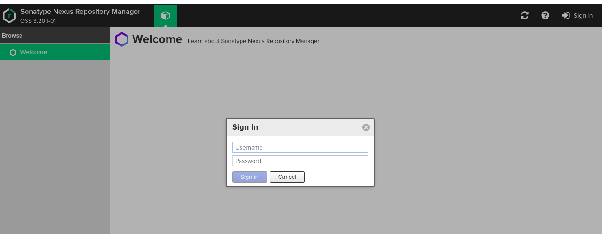

osm_nexus
===================
An ansible role to install and configure Nexus on Ubuntu, Redhat and CentOS.

Version History
---------------

|**Date**| **Version**| **Description**| **Changed By** |
|----------|---------|---------------|-----------------|
|**6 February 2020** | v.3.20 |Updated for CentOS | Abhishek Kapil|
|**9 APril 2019** | v.3.15 | |

Salient Features
----------------

- This Role automates the Nexus setup.


Supported OS
------------

* Ubuntu
* RHEL
* CentOS

Dependencies
------------

* Java 8(64-bit)


Directory Layout
----------------
```
NEXUS

├── defaults
│   └── main.yml
├── handlers
│   └── main.yml
├── README.md
├── tasks
│   ├── install.yml
│   ├── main.yml
│   ├── RedHat.yml
│   └── Ubuntu.yml
├── templates
│   ├── nexus-default.properties.j2
│   ├── nexus-init.j2
│   ├── nexus.rc.j2
│   ├── nexus.service.j2
│   └── nexus.vmoptions.j2
└── vars
    └── main.yml

5 directories, 13 files


```

Role Variables
--------------


|**Variables**| **Default Values**| **Description**| **Type**|
|----------|---------|---------------|-----------|
| nexus_port |8082 | nexus port no. | mandatory |
| nexus_min_memory | 1200M | Minimum memory required | Mandatory |
| nexus_max_memory | 1200M | Maximum memory required | Mandatory |
| nexus_installation_dir | /opt | installation directory for nexus  | Optional |
| nexus_user | nexus | user for nexus | mandatory |
| nexus_group | nexus | group for nexus | mandatory |
|nexus_os_user_shell | /bin/bash| shell used by nexus user | mandatory |

 
Example Playbook
----------------
```
---
- name: It will automate nexus setup
  hosts: server
  become: true
  roles:
    - role: osm_nexus3.2
...

$  ansible-playbook site.yml -i inventory

```

Inventory
----------
An inventory should look like this:-
```ini
[server]                 
192.xxx.x.xxx    ansible_user=ubuntu 
```

**After the successful installation of nexus, browse through the nexus url and you would get your login page**



#Future Proposed Changes
-----------------------

* Will make this role compatiblw for Amazon Linux. 

#References
-------------

* **[Source Code](https://www.vogella.com/tutorials/Nexus/article.html)**


# Author Information

* Abhishek kapil 

